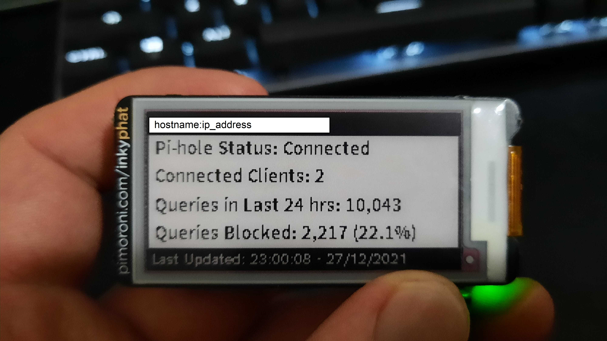
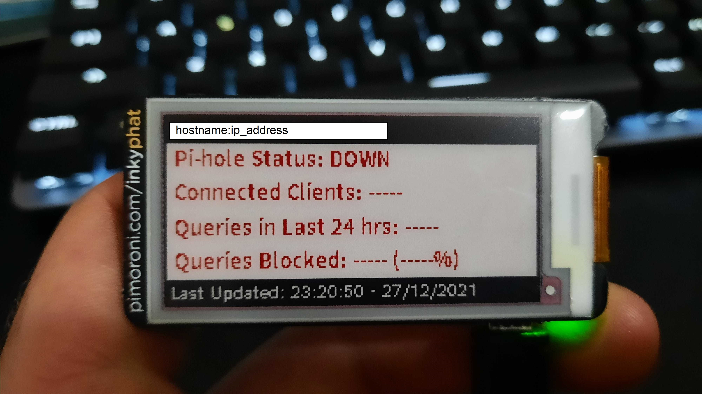

# Pi-hole with Inky pHAT ePaper display

This is my Pi-hole with an ePaper display. There are many like it, but this one is mine.\



This script will trigger a periodic refresh of your Inky pHAT display to show some Pi-hole
stats. You'll see your device's host name and IP (in case you haven't set a static IP address
or need to manually adjust the DNS settings for some of your devices), the last time at which
the display was refreshed, as well as some basic Pi-hole info:

    - Status: connected or not
    - How many clients are currently connected
    - Queries in past 24 hours
    - How many queries (count and percentage) have been blocked

## Setup
1. Set up your Pi-hole, I followed adafruit's instructions [here](https://learn.adafruit.com/pi-hole-ad-blocker-with-pi-zero-w/install-pi-hole).\
   !! If you're working on a Windows machine, make sure you've set Unix style line endings
   when creating your `wpa_supplicant.conf` and `ssh` files !!
2. Set up your Inky pHAT, I followed Pimoroni's instructions [here](https://learn.pimoroni.com/article/getting-started-with-inky-phat).\
   I found that after following the installation instructions, I was unable to 
   run any of the included examples, nor was I able to run any of my own code due to
   a numpy dependency error. The solution was found on 
   [numpy's troubleshooting page](https://numpy.org/devdocs/user/troubleshooting-importerror.html), run:\
   `sudo apt-get install libatlas-base-dev`
3. Clone this repo.
4. Edit your crontab file to set recurring screen refresh:

    ```
    crontab -e
    ```
    add this line:
    ```
    */15 6-24 * * * python <path to pihole_status_display.py>
    ```
    which will trigger the script every 15 minutes on the quarter hour between the hours of 6am and midnight.

## How it works
1. Get and format the update time - date and time at which the script was called. 
2. Pull some board info - the hostname and IP address of your pi.
3. Pull some stats from your Pi-hole API in a struct (dict).
    - If your Pi-hole is up and your pi is able to query the API within 5
      seconds, return status = "Connected", as well as the number of connected
      clients, DNS queries made today, total ads blocked today, and percentage
      of queries blocked.
    - If your pi is unable to query the API, return status = "DOWN", and set all
      the pihole_stats fields to "-----".
4. Draw the results on the Inky pHAT screen.
    - If the API was successfully queried, results will be shown in BLACK.
    - If the script was unable to query the Pi-hole API, the results will
      be shown in RED:\
      
